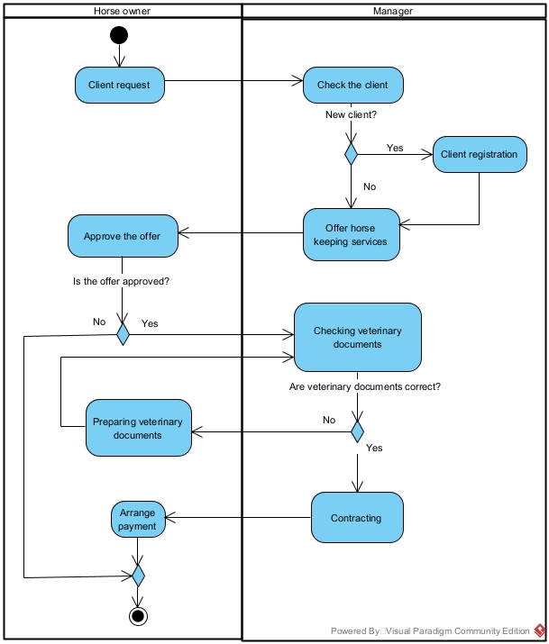

# The equestrian center
## A group project for the Advanced Data Management discipline
## The project stages:
1. Business modeling
2. Conceptual modeling
3. CRUD Matrix designing
4. Logical modeling
5. Physical modeling
6. Database developing
7. Database deploying
8. Master data building
9. Business intelligence integrating

## Team Composition
Members and roles:
1. Petrova Julia - Business analyst
2. Marmysh Ekaterina - Data analyst
3. Mikhaylov Alexander - Developer/ DevOps engineer
## Business modeling
The equestrian center is ...

The company has two areas of activity:
1. Horse keeping service
2. Horse riding service
### Use case diagram
The use-case diagram for the equestrian center was developed to identify the main processes and actors. Diagram was created using the Visual Paradigm modeling tool.

Image 1. The use-case diagram for the equestrian center

Action diagrams have been developed for the main cases from the use case diagram.

### Diagrams for the horse keeping actions:

Image 2. The activity diagram for the for horse keeping contract

## Conceptual modeling
## CRUD Matrix designing
## Logical modeling
## Physical modeling
## Database developing
## Database deploying
## Master data building
## Business intelligence integrating