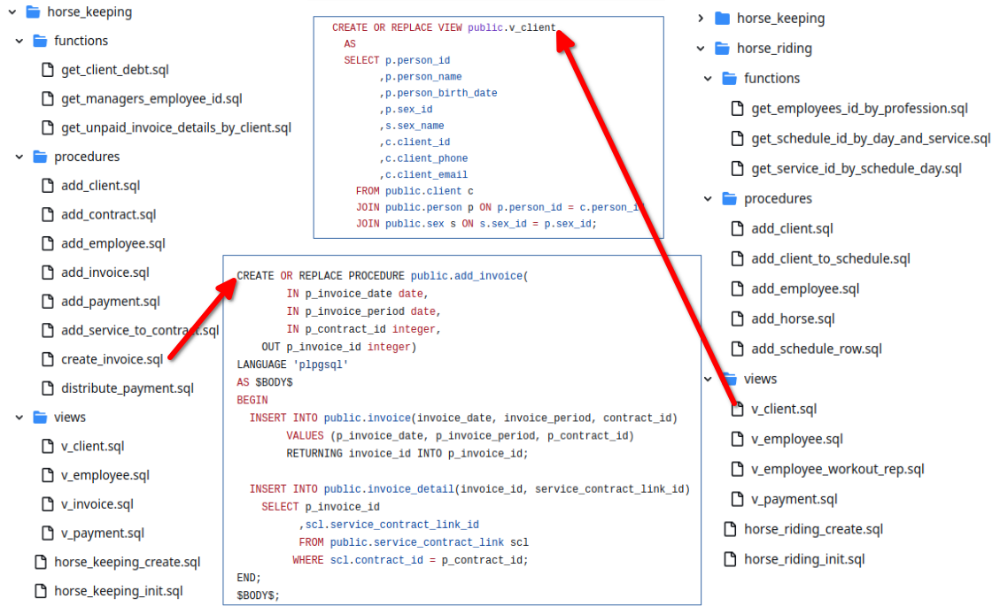
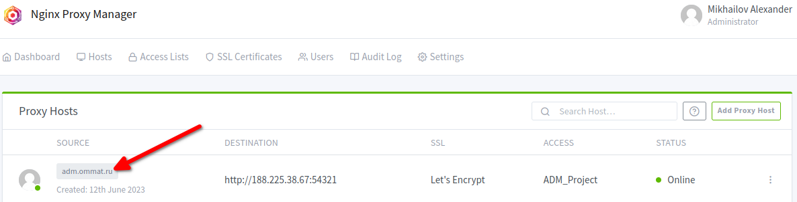

# The equestrian center 🐎
## A group project for the Advanced Data Management discipline
## The project stages:
1. Business modeling
2. Conceptual modeling
3. CRUD Matrix designing
4. Logical modeling
5. Physical modeling
6. Database developing
7. Database deploying
8. Master data building
9. Business intelligence integrating

## Team Composition
Members and roles:
1. Petrova Julia - Business analyst 💡💰
2. Marmysh Ekaterina - Data analyst 💡📊
3. Mikhaylov Alexander - Developer/ DevOps engineer ⚙️🛠️
## 1. Business modeling
The equestrian center is a social and cultural service enterprise, a commercial organization with a private form of ownership. The services of the complex satisfy the needs of clients in leisure, communication, self-realization, physical development and treatment.
The organization provides services to individuals. Services are provided by specific workers, at specific times, with the right horse, specially prepared for a specific client. Also, horse owners can choose horse keeping services on a contractual basis.

The company has two activity areas:
1. Horse keeping service
2. Horse riding service
### 1.1. Use case diagram
The use-case diagram for the equestrian center was developed to identify the main processes and actors. Diagram was created using the [Visual Paradigm](https://www.visual-paradigm.com/) modeling tool.

In the case at hand, Horse owner and Customer-workout are the clients. The employees of the organization are Manager, Stableman, and Coach. Speaking about the clients of the equestrian center, each of them is related to the process of payment for the services. Manager is also involved in this process.

At the same time, Horse owners are involved in the process of conclusion contracts for horse keeping, and Customers-workout in the process of registering clients for horseback riding. Both of these processes also involve Manager.

Turning to the processes linking the organization's clients and employees, which reflect the direct provision of services, the following should be noted. Horse owners and Stablemans are actors in the process of the organization of the horse keeping. The actors Customer-workout and Coach are involved in the process of horseback riding. Coaches are also involved in the scheduling process, which is done with the involvement of Manager.

_Image 1.1. The use-case diagram for the equestrian center_

Action diagrams have been developed for the main cases from the use case diagram.

### 1.2. Diagrams for the horse keeping actions:

First, the process of registering clients for horse keeping services was considered. This process involves the Horse Owner and the Manager. The process is started when there is a request from the client. The Manager then checks whether the client from which the request was made is a new client or not. If the client has not contacted the company before, the manager registers a new client. After registration or if the client has previously visited the equestrian center, the Manager makes an offer for maintenance services. If the client is satisfied with the offer, the Manager informs about the need to check the veterinary documents. Otherwise, the process ends because the organization is unable to meet the client's needs. If the veterinary documents are filled out correctly, the Manager concludes a contract with the client, after which the client pays for the horse keeping. If the veterinary documents are not filled out correctly or are missing, the Horse Owner will prepare the correct documents. Next, the Manager checks the veterinary documents again.

_Image 1.2. The activity diagram for the for horse keeping contract_

The process of organizing services for keeping horses was also considered. The Horse Owner and the Stableman are involved in this process. The process starts when a client brings a horse to be placed in the centre. The Stableman then checks the horse's health, demonstrates where to keep, and clarifies the conditions of keeping, such as feeding rations and training regimen. Next, the client signs the act of transfer of the horse. After that, the Stableman places the horse in a free place. This completes the process.

_Image 1.3. The activity diagram for the for horse keeping organization_

### 1.3. Diagrams for the horse riding actions:

Turning to the description of the processes associated with the organization of the horseback riding lessons, it is initially worth considering the scheduling process. At the beginning of this process the Manager generates a basic schedule. Then the Manager checks whether there are unconfirmed positions in the schedule or not. If there are no contradictions in the schedule, the Manager confirms the schedule. Otherwise, the Manager coordinates inconsistencies with the coaches until the schedule is fully filled and there are no unconfirmed positions in it.

_Image 1.4. The activity diagram for the scheduling_

Next, let's look at the process of registering clients for horseback riding services. This process involves the Customer-workout and the Manager. The process is started when a request from a client arises. Then the Manager checks whether the client from whom the request was made is a new client or not. If the client has not previously referred to the company, the Manager registers a new client. After registration or in case the client has previously visited the equestrian center, the Manager proceeds to check the possibility of the service provided. If it is possible to provide the service - the Manager enroll the client for the horseback riding and then the client arranges payment. Otherwise, the Manager offers the client an alternative variant. If the Customer-workout agrees with the proposed alternative - Manager signs him/her up for the horseback riding and then the client pays for the selected service. If not, the process is completed without enrolling the client and payment, as the organization does not have the opportunity to meet the client's needs.

_Image 1.5. The activity diagram for the client registration_

The last activity diagram reflects the process of providing horse riding services itself. This process is started in case the previously described process is completed with the client enrolling for the horseback riding and receiving payment from the him/her. So, the client comes to the horseback riding lesson at the appointed time and the Coach checks the client's condition - is it possible to admit the client to the riding lesson or not. If the client came to the lesson in an inappropriate state (alcohol intoxication, etc.), the horseback riding lesson is canceling, which leads to the completion of the process. Another case, if horseback riding is permissible, the Coach conducts a safety briefing. The client, in turn, must sign in the technical safety logbooksign that the briefing has been listened to. Next, the Coach hands out the necessary equipment to the Customer-workout and they go horseback riding. At the end of the lesson, the client hands in the company-issued equipment to the Coach.

_Image 1.6. The activity diagram for the riding_

## 2. Conceptual modeling
A conceptual data model is a graphical representation of entities and their relationships used to model the organization of data in databases or information systems. 
This model represents the basic entities for the equestrian center. The model created with [Visual Paradigm](https://www.visual-paradigm.com/) as a data modeling tool.

_Image 2.1. The conceptual ER-diagram for the equestrian center_

## 3. CRUD Matrix designing
### 3.1. Processes defining
Processes were identified based on use case diagrams and activity diagrams.

Processes of the equestrian center:
- Client registration for horseback-riding 
- Get payment for the service
- Registration of the contract for horse keeping
- Scheduling
- Organization of the horse keeping
- Provision horseback riding 
### 3.2. Resources defining
Resources were determined based on the company's activities.

Resources of the equestrian center:
- Service Request Registration System 
- Horse Keeping Management System
### 3.3. Roles defining
Based on the description of the business processes and the use case diagram, roles were identified.

Roles of the equestrian center:
- Manager 
- Horse owner
- Customer-workout
- Stableman
- Coach

After analyzing all the input data, it was decided to build three CRUD MATRIX (image 3.1, image  3.2, image 3.3 show it). The matrix were built in terms of roles to the rest of the output data.

### 3.4. Data CRUD Matrix for the equestrian center

_Image 3.1. CRUD Matrix Data to roles_

### 3.5. Resources CRUD Matrix for the equestrian center

_Image 3.2. CRUD Matrix Resources to roles_

### 3.6. Process CRUD Matrix for the equestrian center

_Image 3.3. CRUD Matrix Processes to roles_

## 4. Logical modeling
The logical ER-diagram is a detailed version of the conceptual ER-diagram. The logical ER model is designed to enrich the conceptual model by explicitly defining columns in each entity and introducing operational and transactional entities. The logical data model is independent of the actual database system.
### 4.1. The logical ER-diagram for the horse keeping system

_Image 4.1. The logical ER-diagram for the horse keeping system_
### 4.2. The logical ER-diagram for the horse riding system

_Image 4.2. The logical ER-diagram for the horse riding system_
## 5. Physical modeling
### 5.1. Choosing a database management system
Postgresql, the world's most advanced open source relational database, was chosen as the database management system for the project.

Russian developers participate in the development of Postgresql, there is a Russian version of Postgres PRO that meets the requirements of the Russian Federal Service for Technical and Export Control.

### 5.2. Physical data modeling
PgModeler, an open-source, multiplatform database modeler for PostgreSQL, was chosen as the data modeling tool. PgModeler is easy to use, allowing the creation and modification of database models with an intuitive interface. 

### The physical ER-diagram for the horse keeping system

_Image 5.1. The physical ER-diagram for the horse keeping system developed using pgModeler_
### The physical ER-diagram for the riding keeping system

_Image 5.2. The physical ER-diagram for the horse riding system developed using pgModeler_

## 6. Database developing
Scripts for database initialization were automatically generated based on the developed physical models, using the pgModeler tool:
- https://github.com/MikhailovAlexander/adm_project/blob/main/db/horse_keeping/horse_keeping_init.sql
- https://github.com/MikhailovAlexander/adm_project/blob/main/db/horse_riding/horse_riding_init.sql

_Image 6.1. Database initial scripts developed using pgModeler_

SQL-scripts have been developed to create database objects, such as procedures, functions and views.

_Image 6.2. Database objects_

A small Python application has been developed to automatically initialize and fill databases for the equestrian center. Database objects were created for each database - tables, relationships, functions, procedures, and views. After that, data was generated to fill the database, including contracts, invoices and payments for the horse keeping center and workout schedule for the horse riding center.

_Image 6.3. Python scripts_

The Python Mimesis library was used to generate personal data of employees, customers and horses. The created data was automatically inserted into the databases.

_Image 6.4. Generate data scripts_

## 7. Database deploying

The solution was deployed using docker-compose with three containers:
- a container with a Postgresql DBMS,
- a container with a python script filling the database,
- a container with a pgAdmin database administration tool.

The solution was deployed on a virtual machine rented from a cloud provider, the infrastructure for deploying the solution is modeled on the ArchiMate diagram.

_Image 7.1. ArchiMate diagram_

Access to pgAdmin was configured using Nginx Proxy Manager.

_Image 7.2. Proxy settings_

Using pgAdmin, access to the databases deployed on the server was configured. All team members could work with databases using a browser, there was no need to install any tools for working with databases.

_Image 7.3. PgAdmin Tool_

## 8. Master data building

The Russian software [Loginom](https://loginom.ru/) is used to create the Master data about the clients of the equestrian center. The chosen program allows to configure the connection to the databases and then check the selected tables for duplicates and contradictions. Upon completion of merging and cleaning the input data imported from the two databases, the Master data is automatically exported to the database.

_Image 8.1. Building the Master data in Loginom_

## 9. Business intelligence integrating

The [Loginom](https://loginom.ru/) software is also used to create the Business intelligence integrating. As this program allows to set up a connection to databases, it is possible to use this program's tools to create Data Marts and Views.

_Image 9.1. Data Marts and Views in Loginom_

Client's Master Data Mart illustrates the distribution of clients based on demographic characteristics. Thus, the graph illustrates the number of customers according to gender and age.

_Image 9.2. Client's Master Data Mart_

Schedule Data Mart is based on data from "riding" data base. This cube, which is shown below, illustrates the number of horseback riding sessions with a particular Coach in the context of services by month.

_Image 9.3. Schedule Data Mart (Data Base riding)_

Invoice Data Mart is based on data from "keeping" data base. The following cube presents the number of horses of the clients (Horse owners) that received a particular service within the keeping period, by months.

_Image 9.4. Invoice Data Mart (Data Base keeping)_

The Invoice-Manager View shows the invoiced amounts of each manager in different months. Theressa Hutchinson and Olin Blair show consistently high performance

_Image 9.5. Invoice-Manager View (Data Base keeping)_

The Invoice-Service View shows the amount of invoices issued by month for different types of horse keeping services. An upward trend is observed

_Image 9.6. Invoice-Service View (Data Base keeping)_

The Payment-Service View presents the amounts of payments grouped by type of horse keeping service in different months. Especially popular in all months are massage, horse workout, hoof cleaning, video surveillance, workout with a set of obstacles.

_Image 9.7. Payment-Service View (Data Base keeping)_

On the Service View, it can be seen that for the entire period under review, approximately the same number of different types of riding services were provided. Hippotherapy and pony riding have a leading position.

_Image 9.8. Service View (Data Base riding)_

The last view displays the amounts of payments for services in different areas of activity by months from January to June. It can be seen that for the direction of the horse keeping the amounts of payments increased in June.

_Image 9.9. Payment-Activity areas View (Data Base keeping & Data Base riding)_
