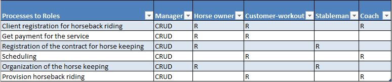

# The equestrian center 🐎
## A group project for the Advanced Data Management discipline
## The project stages:
1. Business modeling
2. Conceptual modeling
3. CRUD Matrix designing
4. Logical modeling
5. Physical modeling
6. Database developing
7. Database deploying
8. Master data building
9. Business intelligence integrating

## Team Composition
Members and roles:
1. Petrova Julia - Business analyst 💡💰
2. Marmysh Ekaterina - Data analyst 💡📊
3. Mikhaylov Alexander - Developer/ DevOps engineer ⚙️🛠️
## 1. Business modeling
The equestrian center is a social and cultural service enterprise, a commercial organization with a private form of ownership. The services of the complex satisfy the needs of clients in leisure, communication, self-realization, physical development and treatment.
The organization provides services to individuals. Services are provided by specific workers, at specific times, with the right horse, specially prepared for a specific client. Also, horse owners can choose horse keeping services on a contractual basis.

The company has two areas of activity:
1. Horse keeping service
2. Horse riding service
### 1.1. Use case diagram
The use-case diagram for the equestrian center was developed to identify the main processes and actors. Diagram was created using the [Visual Paradigm](https://www.visual-paradigm.com/) modeling tool.

In the case at hand, Horse owner and Customer-workout are the clients. The employees of the organization are Manager, Stableman, and Coach. Speaking about the clients of the equestrian center, each of them is related to the process of payment for the services. Manager is also involved in this process.

At the same time, Horse owners are involved in the process of conclusion contracts for horse keeping, and customers-workout in the process of registering clients for horseback riding. Both of these processes also involve Manager.

Turning to the processes linking the organization's clients and employees, which reflect the direct provision of services, the following should be noted. Horse owners and Stablemans are actors in the process of the organization of the horse keeping. The actors Customer-workout and Coach are involved in the process of horseback riding. Coaches are also involved in the scheduling process, which is done with the involvement of manager.

Image 1.1. The use-case diagram for the equestrian center

Action diagrams have been developed for the main cases from the use case diagram.

### 1.2. Diagrams for the horse keeping actions:

Image 1.2. The activity diagram for the for horse keeping contract

Image 1.3. The activity diagram for the for horse keeping organization

### 1.3. Diagrams for the horse riding actions:

Image 1.4. The activity diagram for the scheduling

Next, let's look at the process of registering clients for horseback riding services. This process involves Customer-workout and Manager. The process is started when a request from a client arises. Then the Manager checks whether the client from whom the request was made is a new client or not. If the client has not previously referred to the company, the Manager registers a new client. After registration or in case the client has previously visited the equestrian center, the manager proceeds to check the possibility of the service provided. If it is possible to provide the service - Manager enroll the client for the horseback riding and then the client arranges payment. Otherwise, the manager offers the client an alternative variant. If the client agrees with the proposed alternative - Manager signs him/her up for the horseback riding and then the client pays for the selected service. If not, the process is completed without enrolling the client and payment, as the organization does not have the opportunity to meet the client's needs.

Image 1.5. The activity diagram for the client registration

Image 1.6. The activity diagram for the riding

## 2. Conceptual modeling
A conceptual data model is a graphical representation of entities and their relationships used to model the organization of data in databases or information systems. 
This model represents the basic entities for the equestrian center. The model created with [Visual Paradigm](https://www.visual-paradigm.com/) as a data modeling tool.

Image 2.1. The conceptual ER-diagram for the equestrian center

## 3. CRUD Matrix designing
### 3.1. Processes defining
Processes were identified based on use case diagrams and activity diagrams.

Processes of the equestrian center:
- Client registration for horseback-riding 
- Get payment for the service
- Registration of the contract for horse keeping
- Scheduling
- Organization of the horse keeping
- Provision horseback riding 
### 3.2. Resources defining
Resources were determined based on the company's activities.

Resources of the equestrian center:
- Service Request Registratiom System 
- Horse Keeping Management System
### 3.3. Roles defining
Based on the description of the business processes and the use case diagram, roles were identified.

Roles of the equestrian center:
- Manager 
- Horse owner
- Customer-workout
- Stableman
- Coach

After analyzing all the input data, it was decided to build three CRUD MATRIX (image 3.1, image  3.2, image 3.3 show it). The matrix were built in terms of roles to the rest of the output data.

### 3.4. Data CRUD Matrix for the equestrian center

Image 3.1. CRUD Matrix Data to roles

### 3.5. Resources CRUD Matrix for the equestrian center

Image 3.2. CRUD Matrix Resources to roles

### 3.6. Process CRUD Matrix for the equestrian center

Image 3.3. CRUD Matrix Processes to roles

## 4. Logical modeling
The logical ER-diagram is a detailed version of the conceptual ER-diagram. The logical ER model is designed to enrich the conceptual model by explicitly defining columns in each entity and introducing operational and transactional entities. The logical data model is independent of the actual database system.
### 4.1. The logical ER-diagram for the horse keeping system

Image 4.1. The logical ER-diagram for the horse keeping system
### 4.2. The logical ER-diagram for the horse riding system

Image 4.2. The logical ER-diagram for the horse riding system
## 5. Physical modeling
### 5.1. Choosing a database management system
Postgresql, the world's most advanced open source relational database, was chosen as the database management system for the project.

Russian developers participate in the development of Postgresql, there is a Russian version of Postgres PRO that meets the requirements of the Russian Federal Service for Technical and Export Control.

### 5.2. Physical data modeling
PgModeler, an open-source, multiplatform database modeler for PostgreSQL, was chosen as the data modeling tool.

### The physical ER-diagram for the horse keeping system

Image 5.1. The logical ER-diagram for the horse keeping system
### The physical ER-diagram for the riding keeping system

Image 5.2. The physical ER-diagram for the horse riding system

## 6. Database developing
## 7. Database deploying
## 8. Master data building
The Russian software [Loginom](https://loginom.ru/) is used to create the Master data about the clients of the equestrian center. The chosen program allows to configure the connection to the databases and then check the selected tables for duplicates and contradictions. Upon completion of merging and cleaning the input data imported from the two databases, the Master data is automatically exported to the database.

Image 8.1. Building the Master data

## 9. Business intelligence integrating
